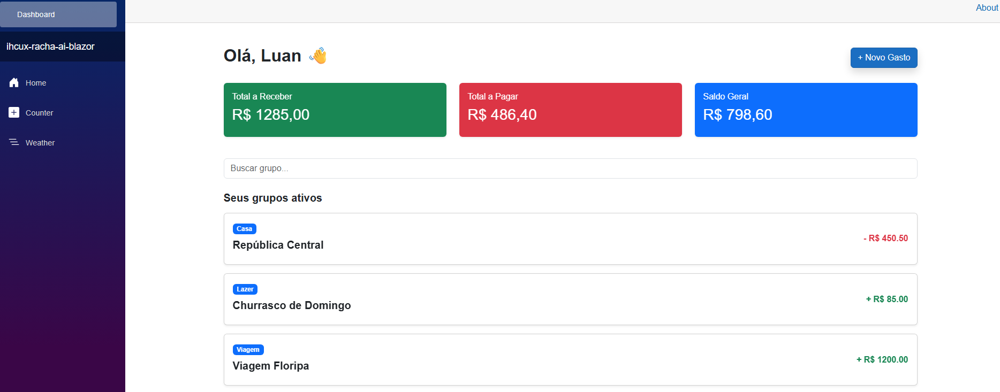

# ihcux-racha-ai-blazor

Projeto desenvolvido para a disciplina de Interação Humano Computador e UX utilizando Blazor e conceitos de UX/UI.

---

# Objetivo

Desenvolver um dashboard financeiro inspirado no aplicativo fictício **RachaAí**, aplicando:

- Hierarquia visual
- Responsividade
- Componentização
- Heurísticas de Nielsen
- UX visual

---

# Funcionalidades

- Dashboard financeiro
- Cards de resumo
- Listagem dinâmica de grupos
- Busca de grupos
- Componentização com Razor Components
- Interface responsiva com Bootstrap

---

# Tecnologias Utilizadas

- C#
- .NET 9
- Blazor
- Bootstrap

---

# Conceitos de IHC & UX Aplicados

- Visibilidade do status do sistema
- Affordance
- Consistência visual
- Design minimalista
- Hierarquia visual
- Reconhecimento em vez de memorização

---

# Estrutura do Projeto

```text
Components/
Models/
wwwroot/

Program.cs
README.md
```

---

# Demonstração

## Dashboard Principal



---

# Implementação Blazor

A interface foi construída utilizando componentes Razor no Blazor.

O componente `GrupoCard` foi criado para reutilizar a estrutura visual dos grupos financeiros, facilitando manutenção e organização do código.

A responsividade foi implementada utilizando o sistema de Grid do Bootstrap.

---

# Dificuldade Técnica

A maior dificuldade foi realizar a componentização do `GrupoCard` e integrar corretamente os componentes dentro da página Dashboard.

---

# Autor

Luan Mauricio
